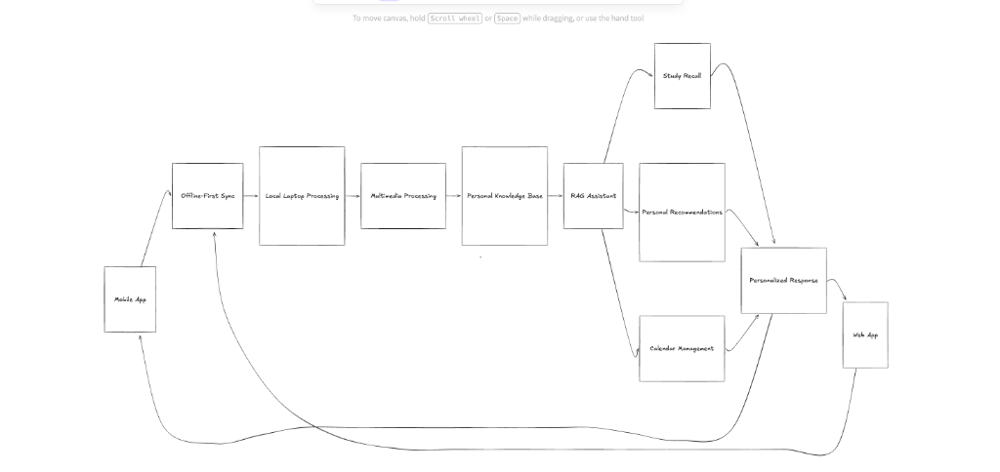
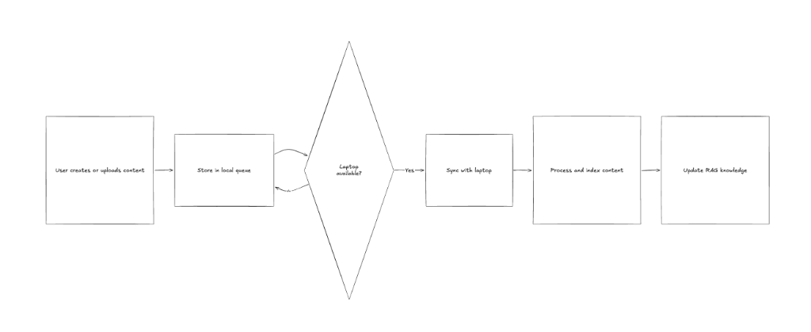

# 📚 Study Buddy — Local-First AI Personal Knowledge Base

**Study Buddy** is an offline-first, privacy-focused personal study workspace designed to capture, organize, synthesize, and query your learning material locally. 

Capture lectures, voice notes, PDFs, slide decks, handwritten notes, and screen snippets. **Study Buddy** transcribes audio/video with precise timestamps, runs OCR and handwriting recognition, automatically classifies items into subjects, generates structured Markdown notes, synthesizes audiobooks, and enables RAG-powered chat with strict source citations — all on your own machine.

---

## 🌟 Key Highlights

- **🔒 100% Local & Private**: No data leaves your machine. Powered by local LLMs (via LM Studio), local vector search (LanceDB), on-device speech-to-text (Moonshine STT), on-device text-to-speech (Kokoro TTS), and smart vision models.
- **💻 Cross-Platform & Laptop Friendly**: Runs natively on **Windows**, **macOS**, and **Linux** with a lightweight footprint fine-tuned for consumer laptops (e.g. 16GB RAM).
- **🎙️ Flexible Capture**: Upload files, PDFs, recordings, and images directly via the Next.js Web Dashboard, or use the optional macOS menu-bar buddy overlay app.
- **🧠 Personalized RAG Assistant**: Multi-modal retrieval augmented generation over your entire personal knowledge base, providing responses backed by direct timestamped `[source: Lecture @ 12:34]` or `[p. N]` citations.
- **✍️ Interactive Handwriting Recognition**: Automatically detects handwritten pages, segments text lines using projection profiles & vision models, zooms crops for Vision LLMs, and learns your handwriting over time using corrected vocabulary hints.
- **🎬 Smart Video Board Extraction**: Samples lecture video frame stability, streams progressive OCR crops via Server-Sent Events (SSE), and consolidates whiteboard notes.
- **🎧 Local Audiobook Synthesis**: Re-writes study notes into flowing spoken scripts and renders WAV audiobooks using Kokoro TTS (82M parameters).

---

## 💻 Windows, macOS & Linux Compatibility

Yes! **Study Buddy runs on Windows (both Native Windows and WSL2)**, as well as macOS and Linux.

| Feature / Component | Windows (Native & WSL2) | macOS | Linux |
|---|---|---|---|
| **FastAPI Backend Server (`server.py`)** | ✅ Fully Supported | ✅ Fully Supported | ✅ Fully Supported |
| **Next.js Web Dashboard (`web/`)** | ✅ Fully Supported | ✅ Fully Supported | ✅ Fully Supported |
| **Streamlit UI (`app.py`)** | ✅ Fully Supported | ✅ Fully Supported | ✅ Fully Supported |
| **LanceDB Vector Store & Embeddings** | ✅ Fully Supported | ✅ Fully Supported | ✅ Fully Supported |
| **Moonshine STT & Silero VAD (Audio/Video)**| ✅ Fully Supported | ✅ Fully Supported | ✅ Fully Supported |
| **Kokoro TTS Audiobook Synthesis** | ✅ Fully Supported | ✅ Fully Supported | ✅ Fully Supported |
| **LM Studio Local LLM & Vision Integration**| ✅ Fully Supported | ✅ Fully Supported | ✅ Fully Supported |
| **PDF Text Extraction (PyMuPDF)** | ✅ Fully Supported | ✅ Fully Supported | ✅ Fully Supported |
| **Handwriting Segmentation & Vision OCR** | ✅ Vision LLM + Projection Profile | ✅ Apple Vision OCR + Vision LLM | ✅ Vision LLM + Projection Profile |
| **Quick Capture Interface** | ✅ Web UI Upload & Inbox Drop | ✅ Menu-Bar Buddy (`rumps`) & Web UI | ✅ Web UI Upload & Inbox Drop |

> **Note for Windows Users**: On Windows, file uploads and recordings are handled directly through the **Next.js Web UI (`http://localhost:3000`)** or by dropping files into the `inbox/` folder. Image text extraction and handwriting recognition automatically use PyMuPDF and the LM Studio Vision model with projection profile line cropping.

---

## 📐 System Architecture & Pipeline Overview

The overall architecture connects capture clients (Web App, Mobile App & macOS Overlay Buddy), an offline-first synchronization loop, background multimedia processing engines, a dual-store personal knowledge base, a RAG assistant, and downstream study modules into a unified Next.js Web App dashboard.



### 🏗️ Architecture Breakdown

1. **Client Capture Layer**:
   - **Web Dashboard**: Upload PDFs, slides, lecture videos, handwritten photos, or audio recordings from any browser.
   - **Mobile App**: Capture notes, record lectures, or photograph handwritten pages on the go.
   - **macOS Menu-Bar Buddy**: Optional screen region capture, pasteboard watcher, microphone recorder, and drop-zone inbox.
2. **Offline-First Sync Engine**:
   - Manages asynchronous file queues locally. Automatically queues uploads while offline and syncs with the desktop backend whenever the laptop is connected.
3. **Local Laptop Processing & Ingestion**:
   - Background worker sweeps the inbox and processes files asynchronously without blocking UI interactions.
4. **Multimedia Processing Engine**:
   - **Audio/Video**: Silero VAD + Moonshine STT (timestamped transcription) + FFmpeg.
   - **PDFs & Scans**: PyMuPDF + Vision LLM fallback.
   - **Video Board State**: Optical diff frame stability analysis + progressive crop OCR.
   - **Handwriting**: Projection line segmentation + line-crop zoom + LM Studio Vision LLM.
5. **Personal Knowledge Base (Dual Storage)**:
   - **SQLite (`app.db`)**: Structured metadata, subjects, notes, handwriting lines, video frames, task lists, audiobook job states.
   - **LanceDB (`lancedb/`)**: Embedded dense vector database storing 384-dimensional text embeddings (`all-MiniLM-L6-v2`) with metadata for semantic retrieval.
6. **RAG Assistant & Downstream Study Modules**:
   - **RAG Assistant**: LanceDB vector search + LM Studio local LLM (e.g. Qwen3-4B).
   - **Study Recall**: Active recall questions, flashcards, key concept summaries.
   - **Personal Recommendations**: Smart study recommendations and note summaries.
   - **Calendar & Task Management**: Lecture timetable tracking, task scheduling, and task management.
7. **Personalized Response & Web Dashboard**:
   - Aggregates insights into the Next.js Web Dashboard for note reading, RAG chat, handwriting editing, video board review, and audiobook playback.

---

## 🔄 Offline-First Sync Pipeline

Study Buddy is built with an offline-first strategy. Content created on mobile or capture devices is stored in a local queue and automatically synced to the primary processing engine when the laptop becomes available.



```
[User Creates / Uploads Content]
            │
            ▼
   [Store in Local Queue]
            │
            ▼
    < Laptop Available? > ──(No)──► [Stay in Local Queue & Retry]
            │
          (Yes)
            │
            ▼
    [Sync with Laptop]
            │
            ▼
  [Process & Index Content] (STT / OCR / Classification / Notes / Vector Embeddings)
            │
            ▼
   [Update RAG Knowledge] (Available in Ask My Notes & Web App)
```

---

## 🛠️ Tech Stack

| Domain | Technology / Library | Description |
|---|---|---|
| **Web Frontend** | **Next.js 15** (App Router), **React 19**, **TypeScript**, **Tailwind CSS**, **Lucide Icons** | Modern dashboard for notes, files, RAG search, handwriting review, and audiobooks |
| **Fallback Frontend** | **Streamlit** | Alternative single-file Python UI (`app.py`) for quick zero-Node testing |
| **Backend Framework** | **FastAPI**, **Uvicorn**, **Pydantic** | RESTful API server + Server-Sent Events (SSE) streaming endpoint |
| **Desktop Capture App**| **Python**, **rumps**, **AppKit**, **sounddevice**, **soundfile** | Native macOS menu-bar overlay buddy (`buddy/menubar.py`) |
| **Database & Vectors** | **SQLite** (`sqlite3`), **LanceDB**, **PyArrow** | Structured storage (`app.db`) + local vector index (`lancedb/`) |
| **Text Embeddings** | **Sentence-Transformers** (`all-MiniLM-L6-v2`) | 384-dimensional dense vector embeddings running on CPU |
| **Local LLM Engine** | **LM Studio** (OpenAI-compatible `/v1` endpoint) | Local text generation & vision model inference (e.g., Qwen3 4B) |
| **Speech-to-Text (STT)**| **Moonshine STT** (`moonshine/base`), **Silero VAD**, **FFmpeg** | On-device timestamped audio/video transcription |
| **Text-to-Speech (TTS)**| **Kokoro TTS** (82M parameters), **soundfile** | Fast, high-quality local speech synthesis for audiobooks |
| **OCR & Vision** | **PyMuPDF** (`fitz`), **Pillow**, **Apple Vision OCR** (`ocrmac` on macOS) | Document text extraction, page rendering, and handwriting crop processing |

---

## ⚙️ Requirements & Prerequisites

- **Operating System**: Windows 10/11 (Native or WSL2), macOS, or Linux.
- **Python**: Version `3.12` (Kokoro TTS requires Python $< 3.13$).
- **Node.js**: Version `18+` (for the Next.js web application).
- **FFmpeg**: Required for audio/video conversion:
  - **Windows**: `winget install FFmpeg` or `choco install ffmpeg`
  - **macOS**: `brew install ffmpeg`
  - **Linux**: `sudo apt install ffmpeg`
- **Optional**: `espeak-ng` (fallback for Kokoro TTS phonemizer).
- **LM Studio**: Running locally with a chat/vision model (e.g. `Qwen3 4B` or similar) with the local server enabled at `http://localhost:1234`.

---

## 🚀 Quick Start & Setup

### Windows Setup (Native PowerShell or Command Prompt)

```powershell
# 1. Clone the repository & navigate to project directory
cd kec-feature

# 2. Create a Python 3.12 virtual environment
uv venv --python 3.12 .venv
# or using standard python:
# python -m venv .venv

# 3. Activate virtual environment and install dependencies
.\.venv\Scripts\activate
uv pip install -r requirements.txt
# or: .\.venv\Scripts\pip install -r requirements.txt

# 4. Create your local environment configuration file
copy .env.example .env

# 5. Start the FastAPI backend server & ingestion worker
python -m uvicorn server:app --host 0.0.0.0 --port 8010

# 6. In a second terminal window, start the Next.js Web Frontend
cd web
npm install
npm run dev
```

### macOS / Linux Setup

```bash
cd kec-feature
uv venv --python 3.12 .venv
uv pip install -p .venv -r requirements.txt
cp .env.example .env

# Terminal 1: Backend API
.venv/bin/uvicorn server:app --host 0.0.0.0 --port 8010

# Terminal 2: Web Frontend Dashboard
cd web && npm install && npm run dev

# Terminal 3 (macOS optional): Overlay Buddy App
.venv/bin/python -m buddy.menubar
```

Access the Web Dashboard at **`http://localhost:3000`**.

> **Alternative Zero-Node UI**: You can also launch the Streamlit interface:
> ```bash
> .venv/bin/streamlit run app.py
> ```
> Access at `http://localhost:8501`.

### Verification Test

Run the automated smoke test script to verify database initialization, vector indexing, and pipeline integrity without requiring full audio or video inputs:

```bash
# Windows:
python scripts/smoke.py

# macOS / Linux:
.venv/bin/python scripts/smoke.py
```

---

## 📋 API Endpoints Reference

The FastAPI backend (`server.py`) exposes the following primary endpoints:

| Endpoint | Method | Description |
|---|---|---|
| `/api/health` | `GET` | Health check endpoint returning API status & LM Studio availability |
| `/api/stats` | `GET` | Knowledge base statistics (notes count, total chunks, disk usage) |
| `/api/upload` | `POST` | Multipart upload for documents, PDFs, audio, video, or image files |
| `/api/notes` | `GET` | List synthesized Markdown study notes |
| `/api/notes/{id}` | `GET` | Fetch specific note detail with full Markdown body |
| `/api/ask` | `POST` | Execute RAG search query over LanceDB vector store |
| `/api/handwriting/upload` | `POST` | Upload handwritten page image for line segmentation |
| `/api/handwriting/pages/{id}` | `GET` | Retrieve line crops, predictions, and user corrections |
| `/api/video/frames` | `GET` | List captured stable video lecture board frames |
| `/api/video/frames/{id}/ocr-stream` | `GET` | SSE stream for progressive line/table board crop OCR |
| `/api/audiobooks` | `POST` | Submit notes to generate narration script and synthesize WAV audiobook |
| `/api/tasks` | `GET / POST` | List or create study tasks and reminders |

---

## 📁 Repository Structure

```
sbu-main/
├── server.py              # FastAPI application server & API endpoints
├── app.py                 # Streamlit homepage (Alternative Python UI)
├── requirements.txt       # Python dependencies manifest
├── .env.example           # Configuration template
├── buddy/
│   └── menubar.py         # macOS menu-bar quick capture app (rumps)
├── core/
│   ├── config.py          # Paths & environment configuration loader
│   ├── db.py              # SQLite database schemas & helpers (`app.db`)
│   ├── ingest.py          # Background inbox watcher & ingestion worker
│   ├── stt.py             # Silero VAD + Moonshine speech-to-text integration
│   ├── ocr.py             # Optical character recognition & PyMuPDF text extractor
│   ├── handwriting.py     # Handwriting segmentation, zoom & LLM active feedback loop
│   ├── video.py           # Lecture video stable frame sampler & OCR consolidation
│   ├── embed.py           # Sentence-transformers embedding wrapper
│   ├── vectorstore.py     # LanceDB vector table manager (`lancedb/`)
│   ├── llm.py             # OpenAI-compatible API client for LM Studio
│   ├── rag.py             # RAG search query parser & answer builder with citations
│   └── audiobook.py       # Script rewrite & Kokoro TTS audio generation
├── architecture_pipeline.png  # System architecture & RAG pipeline diagram
├── offline_sync_flow.png      # Offline-first sync workflow diagram
├── web/                   # Next.js 15 web application dashboard
    ├── src/
    │   ├── app/           # Next.js App Router pages (Notes, Files, Ask, etc.)
    │   └── components/    # UI component library
    └── package.json
```

