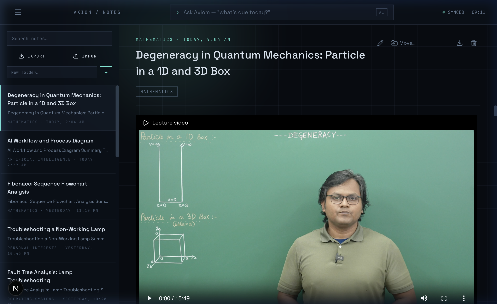
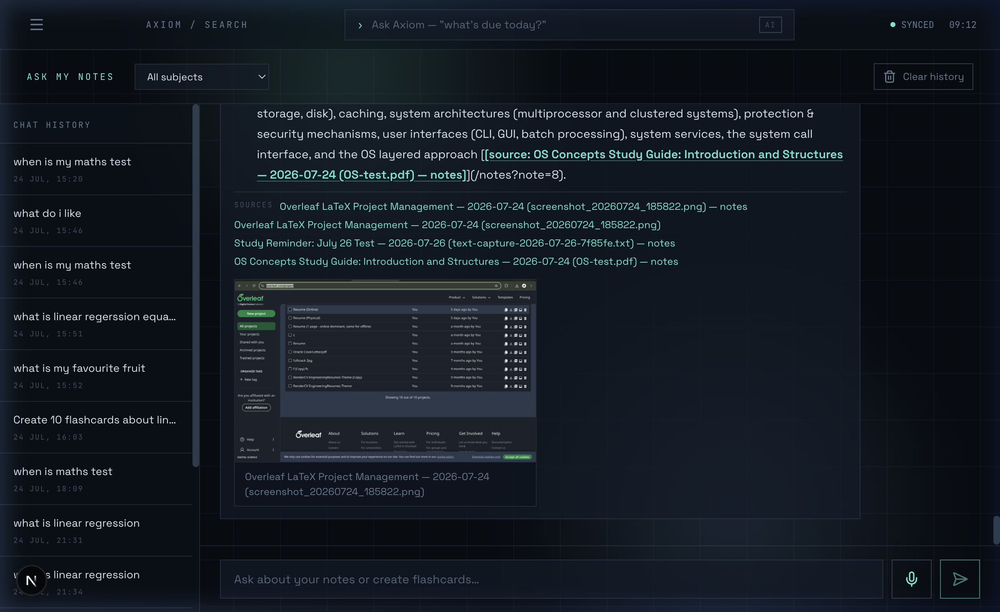
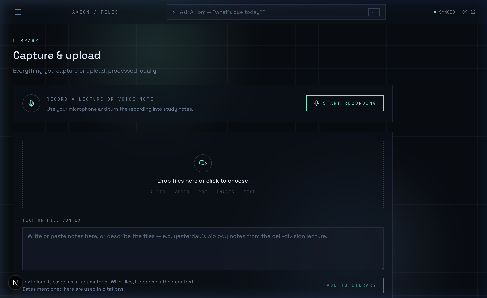
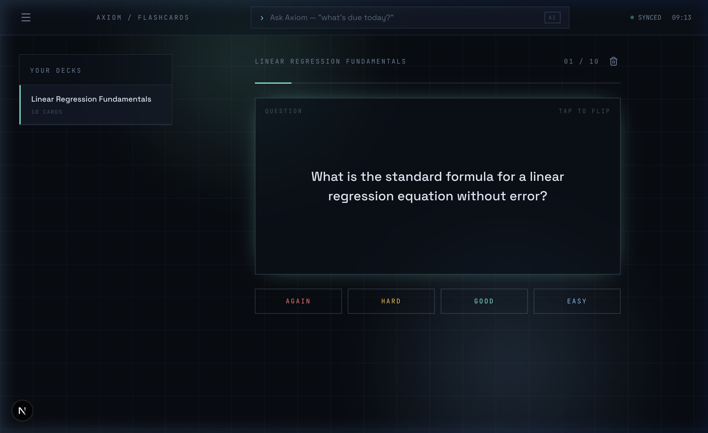
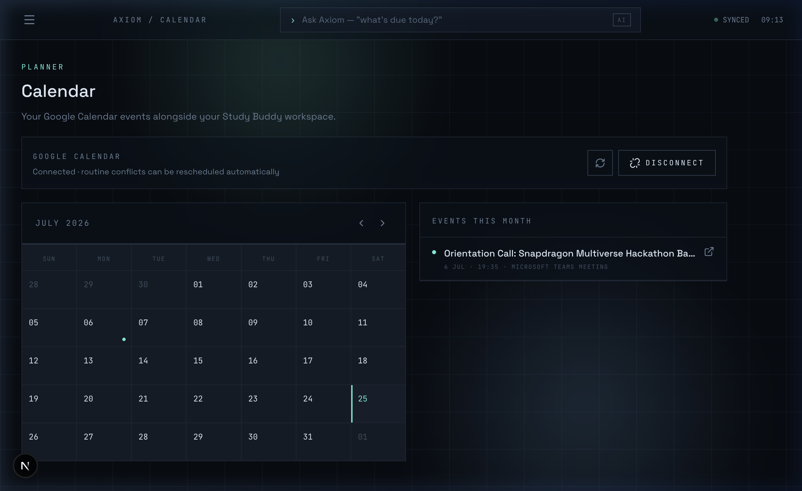
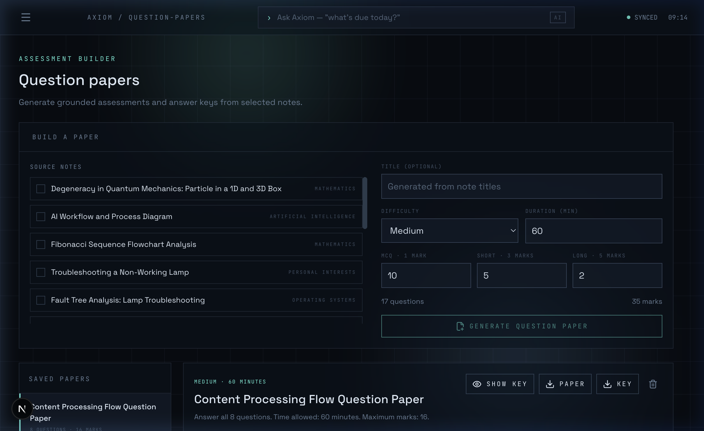
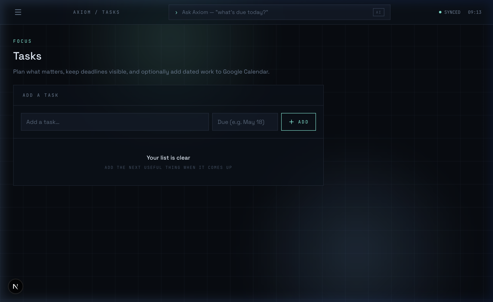
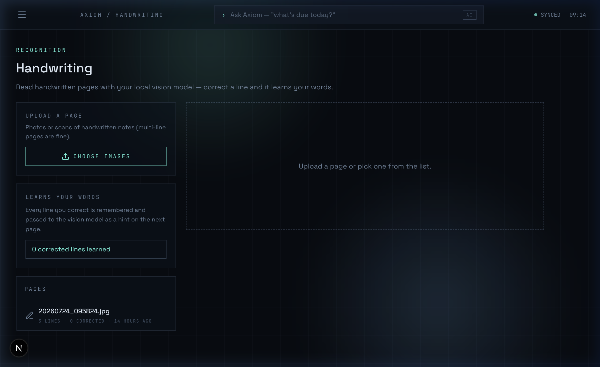
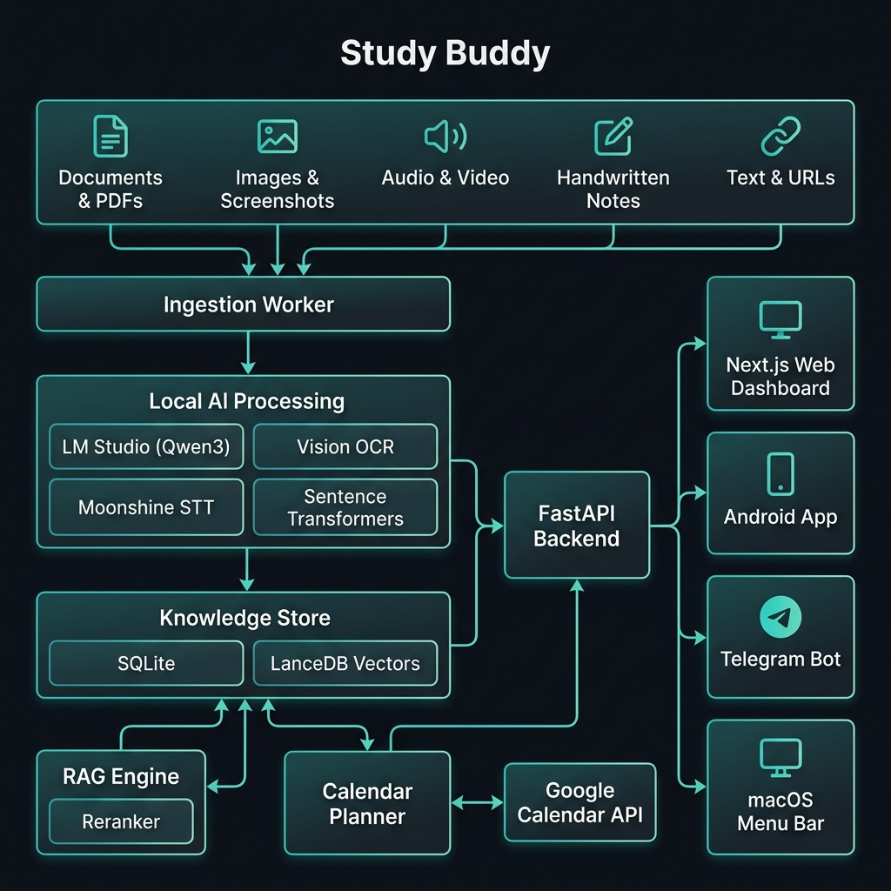
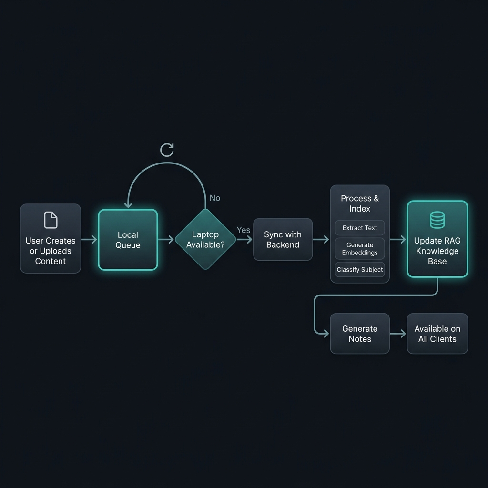

<p align="center">
  
</p>

# Study Buddy

> A local-first personal learning workspace for capturing, organizing,
> searching, and transforming study material — powered by on-device AI.

Study Buddy accepts text, images, PDFs, audio, video, and handwritten pages;
produces editable Markdown notes; and exposes the same FastAPI data model to
the Next.js web dashboard and native Android client.

Core AI processing stays on the laptop through LM Studio, LanceDB, Moonshine
STT, Apple Vision or the configured vision model, and Kokoro TTS. Optional
integrations such as Google Calendar and Telegram communicate with their
respective external services only when configured.

<p align="center">
  
</p>

---

## Features

- **Multimodal ingestion** — documents, images, recordings, screenshots, and
  pasted text, all processed asynchronously.
- **Local AI classification** — structured note generation and cited RAG answers
  using on-device models.
- **Editable notes** — import, export, source files, extracted figures, and
  Mermaid diagrams.
- **Handwriting recognition** — line segmentation, OCR correction, and
  conversion into structured notes.
- **Lecture video review** — stable-frame board detection with progressive OCR.
- **Flashcards** — spaced-repetition decks generated from your notes.
- **Question papers** — grounded assessments with answer keys and print-ready
  PDFs.
- **Tasks & focus timer** — plan deadlines and study sessions with a built-in
  Pomodoro timer.
- **Audiobooks** — locally generated WAV audiobooks from your notes via Kokoro
  TTS.
- **Native Android client** — full workspace backed by the same live API.
- **Study pet** — a floating macOS creature that notices distraction and nudges
  you back with your real tasks, deadlines, and weak concepts.
- **Telegram & macOS menu-bar** — optional quick-capture clients.
- **Google Calendar** — OAuth, event display, task/reminder creation, and
  dynamic conflict-aware rescheduling.

---

## Screenshots

<table>
  <tr>
    <td align="center"><br /><strong>Notes</strong> — Editable Markdown with source video</td>
    <td align="center"><br /><strong>Ask My Notes</strong> — Cited RAG search with source previews</td>
  </tr>
  <tr>
    <td align="center"><br /><strong>Capture & Upload</strong> — Record, drag-and-drop, or paste</td>
    <td align="center"><br /><strong>Flashcards</strong> — Spaced-repetition review</td>
  </tr>
  <tr>
    <td align="center"><br /><strong>Calendar</strong> — Google Calendar with conflict rescheduling</td>
    <td align="center"><br /><strong>Question Papers</strong> — Grounded assessments from notes</td>
  </tr>
  <tr>
    <td align="center"><br /><strong>Tasks</strong> — Deadlines and focus planning</td>
    <td align="center"><br /><strong>Handwriting</strong> — Vision-model OCR with learning</td>
  </tr>
</table>

---

## Study pet

A floating desktop creature for macOS that watches what you are actually doing
and nudges you back to work with your own tasks, deadlines, and weak concepts.

```bash
cd backend && uv run --python 3.12 python -m pet
```

It samples the frontmost application every five seconds and, for Safari, Chrome,
Arc, and Brave, the active tab. macOS asks once for permission to control each
browser; without it the pet still works from the application name alone.
Nothing is written to disk and nothing leaves the machine—classification and
dialogue run through local LM Studio, and the activity log is a bounded
in-memory ring.

Escalation follows continuous distraction: at 90 seconds the pet turns alert, at
3 minutes it walks to the offending window and speaks, at 6 minutes it names
what is actually due, and at 10 minutes it pleads and repeats every 4 minutes. A
minute of real study resets it, and two speech bubbles are never closer than 90
seconds. Pause it from the 🐾 menu bar before screen sharing.

Every threshold is configurable through the `PET_*` variables documented in
`.env.docker.example`. Sprites live in `backend/assets/pet/`; replacing the PNGs
and `meta.json` with real artwork at the same frame size changes nothing else.
See [backend/README.md](backend/README.md) for the full runbook.

---

## Architecture

<p align="center">
  
</p>

The FastAPI process owns one ingestion worker and persists structured state in
SQLite. Text chunks and embeddings live in LanceDB. Web, Android, Streamlit,
Telegram, the macOS menu-bar app, and the study pet are clients of the same
backend contract.

### Offline-first sync

<p align="center">
  
</p>

Content captured on mobile or via the menu-bar app queues locally and syncs
with the laptop backend when reachable. Processing, indexing, and note
generation happen server-side, then results are available on all clients.

---

## Technology

| Area | Current implementation |
| --- | --- |
| Web | Next.js 16.2, React 19, TypeScript, Tailwind CSS 4, Framer Motion |
| Android | Kotlin, Jetpack Compose, native HTTP and media APIs |
| API | Python 3.12, FastAPI, Uvicorn, Pydantic |
| Local AI | LM Studio OpenAI-compatible API |
| Retrieval | LanceDB, PyArrow, Sentence Transformers, optional Qwen3 reranker |
| Speech | Moonshine STT, Silero VAD, FFmpeg |
| Documents | PyMuPDF, Pillow, Apple Vision OCR on macOS |
| Audio generation | Kokoro TTS, soundfile |
| Desktop pet | PyObjC/AppKit floating window, rumps menu bar, AppleScript tab sampling |
| Calendar | Google Calendar API with OAuth 2.0 |

---

## Requirements

- Python 3.12
- [uv](https://docs.astral.sh/uv/)
- [Bun](https://bun.sh/) for the web app
- FFmpeg for audio and video ingestion
- LM Studio with the configured text and vision models
- Android Studio/JDK for the optional mobile client
- Google Cloud OAuth credentials only when Calendar integration is wanted

Install FFmpeg with `brew install ffmpeg` on macOS,
`sudo apt install ffmpeg` on Debian/Ubuntu, or `winget install FFmpeg` on
Windows.

---

## Quick start

Clone the repository, then create the backend configuration:

```bash
cp backend/.env.example backend/.env
```

Start the backend:

```bash
make backend
```

The command uses the locked `backend/pyproject.toml` and `backend/uv.lock`
environment. It also starts the optional macOS menu-bar client and Telegram bot
when supported and configured. Disable them with
`STUDY_BUDDY_MENUBAR=0` or `STUDY_BUDDY_TELEGRAM=0`.

In another terminal, start the web app:

```bash
make frontend
```

Open [http://localhost:3000](http://localhost:3000). The API listens at
[http://127.0.0.1:8010/api](http://127.0.0.1:8010/api), with interactive
documentation at
[http://127.0.0.1:8010/api/docs](http://127.0.0.1:8010/api/docs).

The fallback Streamlit UI can be started from `backend/`:

```bash
uv run --python 3.12 streamlit run app.py
```

---

## Dynamic calendar rescheduling

Uploaded material is checked for explicit upcoming commitments — not only exams,
but also classes, meetings, appointments, travel, shifts, interviews,
deadlines, and personal plans.

When Google Calendar is connected:

1. The ingestion worker extracts dated events from the source.
2. The planner reads the affected eight-day calendar window.
3. Safe lower-priority solo events are moved into open 30-minute slots between
   07:00 and 22:00, searching up to seven days ahead.
4. The new event is created after the moves succeed.
5. If creation fails, completed moves are rolled back.

The system does not silently move events with attendees, recurring events,
protected commitments, or events with equal or higher priority. Cross-day
moves, more than three changes, and unresolved conflicts are persisted as plans
for review in the web calendar. Every applied or dismissed plan is recorded in
SQLite.

Google Calendar access is optional. Without OAuth configuration, extracted
events remain reviewable proposals and the rest of ingestion continues
normally.

---

## Docker

The backend and web dashboard are production-containerized. LM Studio is
deliberately not included: it continues to run on the laptop and exposes its
OpenAI-compatible server to the backend.

Create the Docker configuration and start the stack:

```bash
cp .env.docker.example .env.docker
docker compose --env-file .env.docker up --build -d
```

Open [http://localhost:3000](http://localhost:3000). Backend data, the inbox,
and downloaded model caches are stored in named volumes and survive container
replacement. View status and logs with:

```bash
docker compose --env-file .env.docker ps
docker compose --env-file .env.docker logs -f
```

When Docker and LM Studio run on the same laptop, keep:

```dotenv
LMSTUDIO_BASE_URL=http://host.docker.internal:1234/v1
```

Enable LM Studio's local server and allow network access. When the backend
container runs on another server, `host.docker.internal` refers to that server,
not the laptop. Set `LMSTUDIO_BASE_URL` to the laptop's private LAN or VPN
address reachable from the server instead:

```dotenv
LMSTUDIO_BASE_URL=http://100.64.0.10:1234/v1
```

A private VPN such as Tailscale is strongly preferred over exposing LM Studio
to the public internet. The Study Buddy API currently has no user
authentication, so put remote deployments behind HTTPS and access control or
restrict them to a private network.

The web container proxies `/api` to the backend over the Compose network. To
deploy the web image and backend image on different servers, build the web
image with the backend's reachable URL:

```bash
docker build \
  --build-arg STUDY_BUDDY_API_URL=https://api.example.com \
  -t study-buddy-web ./web
```

For production, also set `APP_ENV=production`, `LOG_FORMAT=json`,
`TRUSTED_HOSTS`, `CORS_ORIGINS`, `FORWARDED_ALLOW_IPS`, `WEB_BASE_URL`, and the
Google OAuth redirect URI to their real public values.

The Android client cannot run as a server container, but its debug APK can be
built reproducibly in Docker:

```bash
mkdir -p dist/android
docker compose --env-file .env.docker --profile tools run --rm android-build
```

The APK is written to `dist/android/study-buddy-debug.apk`. Set
`ANDROID_API_URL` in `.env.docker` to the initial backend address embedded in
the build; users can still change it in the app.

---

## Google Calendar setup

Create a Google Cloud OAuth web client, enable the Calendar API, and add this
authorized redirect URI:

```text
http://localhost:8010/api/calendar/google/callback
```

Then configure `backend/.env`:

```dotenv
GOOGLE_CALENDAR_CLIENT_ID=
GOOGLE_CALENDAR_CLIENT_SECRET=
GOOGLE_CALENDAR_REDIRECT_URI=http://localhost:8010/api/calendar/google/callback
GOOGLE_CALENDAR_TIMEZONE=Asia/Kolkata
```

Connect the account from the Calendar page. The requested
`calendar.events` scope permits the application to read, create, and move
events on the primary calendar.

---

## Checks

```bash
make backend-test
make backend-smoke
bun --cwd web run lint
bun --cwd web run build
```

---

## Main API groups

| Group | Representative endpoints |
| --- | --- |
| System | `GET /api`, `/api/health/*`, `/api/stats`, `/api/activity` |
| Library | `/api/upload`, `/api/items`, `/api/subjects` |
| Notes | `/api/notes/*`, import, export, download, source files |
| Chat | `POST /api/ask`, `POST /api/ask/audio`, `/api/chat` |
| Study tools | `/api/flashcards/*`, `/api/tasks/*`, `/api/audiobooks/*` |
| Assessments | `/api/question-papers/*` |
| Visual input | `/api/handwriting/*`, `/api/video/*`, `/api/doc/figures/*` |
| Calendar | `/api/calendar/google/*`, `/api/calendar/proposals/*`, `/api/calendar/plans/*` |

The OpenAPI document at `/api/openapi.json` is the source of truth for request
and response schemas.

---

## Repository layout

```text
.
├── backend/
│   ├── server.py                 FastAPI routes
│   ├── app.py                    Streamlit fallback
│   ├── core/
│   │   ├── calendar_planner.py   deterministic rescheduling policy
│   │   ├── google_calendar.py    OAuth and Google event execution
│   │   ├── ingest.py             extraction and background processing
│   │   ├── db.py                 SQLite schema and access
│   │   ├── question_papers.py    grounded assessment generation
│   │   └── ...                   RAG, OCR, STT, video, notes, audio
│   ├── pet/                      macOS study pet loop, state machine, window
│   ├── assets/pet/               pet sprite sheets and frame metadata
│   ├── study_buddy/              supervised backend runtime
│   └── tests/
├── web/                          Next.js dashboard
├── mobile/                       native Android client
├── scripts/                      development launch helpers
├── docs/
│   ├── images/                   screenshots and diagrams
│   └── superpowers/              design specifications and plans
└── Makefile
```

See [backend/README.md](backend/README.md),
[web/README.md](web/README.md), and [mobile/README.md](mobile/README.md) for
component-specific details.

---

## License

This project is proprietary. All rights reserved.
