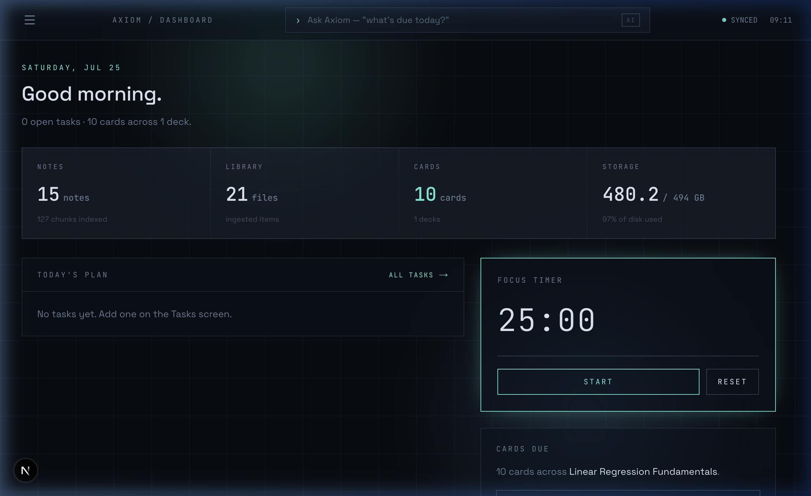

# Study Buddy backend

> The Python backend is the common API and processing runtime for both the web
> dashboard and mobile clients.

It contains the FastAPI service, background ingestion pipeline,
editable portable notes, extracted figures, persistent chat, flashcards,
grounded question papers, Google Calendar integration with conflict-aware
rescheduling, Telegram UI, handwriting recognition, video-board review, local
model integrations, Streamlit fallback UI, and macOS menu-bar capture app.

<p align="center">
  
</p>

From the repository root, setup dependencies as described in the main README,
then start the API and ingestion worker with one command:

```bash
make backend
```

The first run creates `backend/.venv` and installs the locked dependencies from
`pyproject.toml` and `uv.lock`. On macOS this command also starts the 📚 menu-bar capture app. When a
`TELEGRAM_BOT_TOKEN` is configured, it starts the Telegram polling bot as well.
The package runtime supervises optional clients, FastAPI owns one ingestion
worker, and all processes stop together. Set `STUDY_BUDDY_MENUBAR=0` or
`STUDY_BUDDY_TELEGRAM=0` to disable either optional interface.

The API listens on port 8010 by default:

- API discovery: `http://127.0.0.1:8010/api`
- Interactive docs: `http://127.0.0.1:8010/api/docs`
- OpenAPI contract: `http://127.0.0.1:8010/api/openapi.json`
- Liveness: `http://127.0.0.1:8010/api/health/live`
- Readiness: `http://127.0.0.1:8010/api/health/ready`

## RAG reranking

Ask My Notes retrieves a broad LanceDB candidate set and reranks it with
`mlx-community/Qwen3-Reranker-0.6B-mxfp8` before building the answer context.
Download that model in LM Studio, enable the local server, and keep
`RERANKER_ENABLED=true`. The integration uses LM Studio's OpenAI-compatible
`/v1/chat/completions` endpoint with thinking disabled to obtain Qwen3's
first-token yes/no relevance probabilities. If reranking is temporarily
unavailable, the request safely retains the original vector-search order.

The defaults can be adjusted in `.env`:

```dotenv
RERANKER_MODEL=mlx-community/Qwen3-Reranker-0.6B-mxfp8
RERANKER_CANDIDATE_K=24
RERANKER_MAX_CHARS=6000
```

Every response includes `X-Request-ID`, `X-Process-Time-Ms`, and
`X-API-Version`. Send an existing `X-Request-ID` to correlate client and server
logs.

## Calendar automation

`core.ingest` asks the local model to extract any explicit upcoming commitment
from processed material. Exams are one supported event type; appointments,
meetings, classes, travel, shifts, interviews, deadlines, and personal plans
use the same flow.

`core.calendar_planner` is deterministic and does not delegate safety decisions
to the model. It:

- assigns category-based priorities;
- protects attendee, recurring, explicitly non-movable, and sensitive events;
- moves only lower-priority solo events;
- searches 30-minute slots from 07:00 to 22:00 for up to seven days;
- marks cross-day moves, cascades larger than three events, and unresolved
  conflicts as requiring confirmation.

If Google Calendar is connected, uncomplicated plans are applied during
ingestion. Complex plans stay proposed for the web UI. Google event execution
rechecks original times immediately before each write and rolls back completed
moves if creating the captured event fails. Plan JSON, status, errors, and
application timestamps are stored in `calendar_reschedule_plans`.

Configure OAuth in `backend/.env`:

```dotenv
GOOGLE_CALENDAR_CLIENT_ID=
GOOGLE_CALENDAR_CLIENT_SECRET=
GOOGLE_CALENDAR_REDIRECT_URI=http://localhost:8010/api/calendar/google/callback
GOOGLE_CALENDAR_TIMEZONE=Asia/Kolkata
```

The Calendar API routes are:

| Method and path | Purpose |
| --- | --- |
| `GET /api/calendar/google/status` | OAuth and proposal counts |
| `GET /api/calendar/google/auth-url` | Begin Google OAuth |
| `GET /api/calendar/google/callback` | Complete Google OAuth |
| `GET /api/calendar/google/events` | Read an ISO date-time range |
| `POST /api/calendar/google/sync` | Retry approved reminders |
| `DELETE /api/calendar/google` | Revoke and remove local credentials |
| `GET /api/calendar/proposals` | List extracted events awaiting action |
| `POST /api/calendar/proposals/{id}/plan` | Build a fresh conflict plan |
| `POST /api/calendar/proposals/{id}/dismiss` | Dismiss an extracted event |
| `GET /api/calendar/plans/{id}` | Read a persisted plan |
| `POST /api/calendar/plans/{id}/apply` | Validate and execute a plan |
| `POST /api/calendar/plans/{id}/dismiss` | Dismiss a plan |

The legacy proposal approval endpoint remains available for clients that add an
event without conflict planning. New clients should prefer the plan/apply flow.

## Question papers

`core.question_papers` generates assessments exclusively from user-selected
notes. Clients choose difficulty, duration, and counts for one-mark MCQs,
three-mark short answers, and five-mark long answers. The backend calculates
the total marks, gives every selected note a share of the model context, and
generates at most five questions per model response to prevent long JSON
completions from being truncated. LM Studio JSON Schema constrained decoding
guarantees the response structure before application validation checks the
exact question mix, MCQ options, answers, and duplicates.

Each paper and its answer key are persisted transactionally in
`question_papers` and `question_paper_questions`. MCQs must have four distinct
options and one validated answer. Student downloads omit answers; answer-key
downloads include model answers and marking explanations. Both downloads are
print-ready A4 PDFs with section headings, response space, and page numbers.

Generation runs as a background job so multi-batch local-model work cannot
outlive an HTTP request or frontend proxy timeout. Job status and actionable
errors persist in `question_paper_jobs`; clients poll the jobs endpoint.

| Method and path | Purpose |
| --- | --- |
| `GET /api/question-papers` | List saved papers |
| `POST /api/question-papers` | Queue generation from selected note IDs |
| `GET /api/question-papers/jobs` | Poll generation status and errors |
| `GET /api/question-papers/{id}` | Read questions and answer key |
| `GET /api/question-papers/{id}/download` | Download student PDF |
| `GET /api/question-papers/{id}/download?answers=true` | Download answer-key PDF |
| `DELETE /api/question-papers/{id}` | Delete a paper and its questions |

Run the smoke check with:

```bash
make backend-smoke
```

Run the test suite with:

```bash
make backend-test
```

For production, set `APP_ENV=production`, `LOG_FORMAT=json`, explicit
`TRUSTED_HOSTS`, explicit `CORS_ORIGINS`, and the proxy addresses allowed to set
forwarding headers in `FORWARDED_ALLOW_IPS`.
